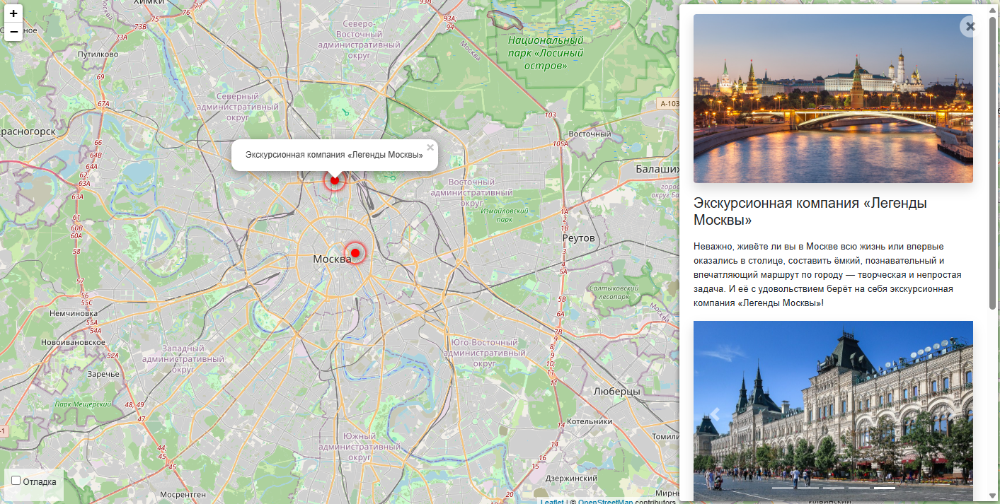

# Куда пойти — интересные места Москвы
Сайт о самых интересных местах в Москве.



## Запуск

Для запуска сайта у вас уже должен быть установлен Python 3.

- Скачайте код
- Установите зависимости командой `pip install -r requirements.txt`
- Запустите сервер командой `python3 manage.py runserver`

После этого переходите по ссылке [127.0.0.1:8000](http://127.0.0.1:8000), вы увидите главную страницу.

## Переменные окружения

Часть настроек проекта берётся из переменных окружения. Чтобы их определить, создайте файл `.env` рядом с `manage.py` и запишите туда данные в таком формате: `ПЕРЕМЕННАЯ=значение`.

Доступны следущие переменные:
- `DEBUG` — дебаг-режим. Поставьте `True`, чтобы увидеть отладочную информацию в случае ошибки. Выключается значением `False`.
- `SECRET_KEY` — секретный ключ проекта.
- `ALLOWED_HOSTS` — см [документацию Django](https://docs.djangoproject.com/en/3.1/ref/settings/#allowed-hosts).
- `STATIC_URL` — по умолчанию это `'/static/'`.
- `STATIC_ROOT` — по умолчанию это `'static'`.
- `MEDIA_URL` — по умолчанию это `'/media/'`.
- `MEDIA_ROOT` — по умолчанию это `'media'`.

## Быстрая загрузка данных о местах
Чтобы быстро загрузить данные о конкретном месте, необходимо выполнить команду в терминале (находясь в папке проекта):
```
python manage.py load_place http://адрес/файла.json
```
где `http://адрес/файла.json` - ссылка на url адрес json файла с данными о месте.

Формат json файла:
```
{
    "title": "Название места",
    "imgs": [
        "http://адрес/изображения1.jpg",
        "http://адрес/изображения2.jpg",
        "http://адрес/изображения3.jpg"
    ],
    "description_short": "Краткое описание",
    "description_long": "Подробное описание",
    "coordinates": {
        "lng": "36.26108899999998",
        "lat": "55.65323799999996"
    }
}
```

## Цели проекта

Код написан в учебных целях — это урок в курсе по Python и веб-разработке на сайте [Devman](https://dvmn.org).